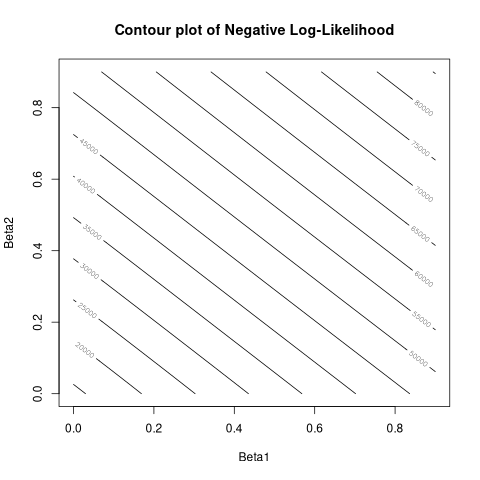

```{r setup, include=FALSE}
knitr::opts_chunk$set(echo = TRUE, fig.width = 5, fig.height = 5,
                      fig.align = 'center', message = FALSE, warning = FALSE,
                      fig.pos='H', echo=FALSE)

```


```{r lib, echo=FALSE}
# setwd("./script")
library(generain)
library(reshape2)
library(ggplot2)
source("load_libraries.R")
library(kableExtra)
library(extRemes)
library(bbmle)
library(ismev)
library(extRemes)
library(evd)
library(dplyr)

btf_theme <- theme_minimal() +
  theme(axis.text.x = element_text(size =  6, angle = 0),
        axis.text.y = element_text(size = 6),
        axis.title.x = element_text(size = 8),
        axis.title.y = element_text(size = 8),
        legend.title = element_text(size = 8),
        legend.text = element_text(size = 6),
        title = element_text(size = 10),
        axis.line = element_blank(),  # Remove axis lines
        panel.border = element_blank(),  # Remove plot border
        panel.background = element_rect(fill = "transparent", color = NA),
        # Remove plot background
        axis.text = element_blank(),  # Remove axis text
        axis.ticks = element_blank(),  # Remove axis ticks
        plot.background = element_rect(fill = "transparent", color = NA),
        panel.grid = element_line(color = "#5c595943"))

# my green color
btfgreen <- "#69b3a2"
```

# The $r$-Pareto process

Our rainfall process is $X=\{X_{s, t}, (s, t) \in S \times T\}$, where $S$ is
the spatial domain and $T$ the temporal domain.

We have
$X_{s, t} \mid r(X_{s, t}) > u \xrightarrow{d} Z_{s, t}$ with a risk function 
$r(X_{s, t}) = X_{s_0, t_0}$, a threshold $u>1$ and $Z=\{Z_{s, t}, (s, t) \in S \times T\}$ 
a $r$-Pareto process.

With $W=\{W_{s, t}, (s, t) \in S \times T\}$ the Gaussian process of the 
Brown-Resnick process and its variogram $\gamma$, 
we can define the $r$-Pareto process as
\[
Z_{s, t} = R_{s, t} e^{W_{s, t} - W_{s_0, t_0} - \gamma(s - s_0, t - t_0)}
\]
where $R_{s, t}$ is a random variable following a simple Pareto distribution. 

The variogram $\gamma$ is defined as
\[
\gamma(ds, dt) = \beta_1 |ds|^{\alpha_1} + \beta_2 dt^{\alpha_2}
\]
with $ds = s - s'$, $dt=t-t'$, $\beta_1, \beta_2 > 0$ and $\alpha_1, \alpha_2 \in (0, 1)$.

If we add an advection vector $V = (v_x, v_y)$, the variogram becomes
\[
\gamma(ds, dt) = \beta_1 |ds - Vdt|^{\alpha_1} + \beta_2 dt^{\alpha_2}.
\]


# The $r$-Pareto process without advection

## Simulation 

We simulate the $r$-Pareto process with the parameters $\beta_1 = 0.4$,
$\beta_2 = 0.2$, $\alpha_1 = 1.5$, $\alpha_2 = 1$ and without advection. 
We simulate the process on a $5 \times 5$ grid with $30$ time steps and $m=100$ realizations.
We use a conditonal point $s_0 = (1, 1)$ at time $t_0 = 1$.

```{r rparetosim2, fig.width = 5, fig.height = 5, echo=FALSE, fig.cap="Time series for 4 sites of the first realization"}
adv <- c(0, 0) # advection
params <- c(0.4, 0.2, 1.5, 1) # ok verif sur simu
true_param <- c(params, adv)
beta1 <- params[1]
beta2 <- params[2]
alpha1 <- params[3]
alpha2 <- params[4]
ngrid <- 5
spa <- 1:ngrid
nsites <- ngrid^2 # if the grid is squared
temp <- 1:30

# Conditional point
s0 <- c(1, 1)
t0 <- 1

# Number of realizations
nres <- 100

# Simulate the process
simu <- sim_rpareto(beta1, beta2, alpha1, alpha2, spa, spa, temp, adv, s0,
                    t0, nres)

if (any(adv < 1)) {
  adv_int <- adv * 10
} else {
  adv_int <- adv
}
adv_str <- sprintf("%02d_%02d", adv_int[1], adv_int[2])

# Save the data
foldername <- paste0("../data/simulations_rpar/sim_", ngrid^2, "s_",
                                length(temp), "t_", adv_str, "/")


if (!dir.exists(foldername)) {
  dir.create(foldername, recursive = TRUE)
}

save_simulations(simu, ngrid, nres, folder = foldername,
        file = paste0("rpar_", ngrid^2, "s_", length(temp), "t"))

# nres <- length(list.files(foldername))
list_simu <- list()
for (i in 1:nres) {
  file_name <- paste0(foldername, "rpar_", ngrid^2, "s_",
                        length(temp), "t_", i, ".csv")
  list_simu[[i]] <- read.csv(file_name)
}

# Plot the first realization
simu_df <- list_simu[[1]]
sites_coords <- generate_grid_coords(ngrid)
par(mfrow = c(2, 2),
    cex = 0.7,
    pin = c(2, 1),
    lwd = 0.5,
    col = btfgreen)
plot(simu_df$S1, main = "S1=S0", xlab = "Time", ylab = "Rainfall")
plot(simu_df$S2, main = "S2", xlab = "Time", ylab = "Rainfall")
plot(simu_df$S10, main = "S10", xlab = "Time", ylab = "Rainfall")
plot(simu_df$S20, main = "S20", xlab = "Time", ylab = "Rainfall")
```

```{r together2, fig.width = 5, fig.height = 5, echo=FALSE, fig.cap="Time series for 4 sites of the all replicates together"}
simu_all <- do.call(rbind, list_simu)

par(mfrow = c(2, 2),
    cex = 0.7,
    pin = c(2, 1),
    lwd = 0.5,
    col = btfgreen)
plot(simu_all$S1, main = "S1=S0", xlab = "Time", ylab = "Rainfall")
plot(simu_all$S2, main = "S2", xlab = "Time", ylab = "Rainfall")
plot(simu_all$S10, main = "S10", xlab = "Time", ylab = "Rainfall")
plot(simu_all$S20, main = "S20", xlab = "Time", ylab = "Rainfall")
```

## Probability of exceedances for the $r$-Pareto process without advection

### For $(s_0, t_0)$

Verification that $P(X_{s_0, t_0} > u) = 1$ because of the $r$-Pareto process construction.

```{r}
# Get the conditional point
s0 <- c(1, 1)
t0 <- 1

# Get the value of the process at the conditional point
simu_df <- list_simu[[1]]
val_s0_t0 <- simu_df[s0[1] + (s0[2] - 1) * ngrid, t0] # superior to 1
print(paste0("X_s0_t0 = ",  round(val_s0_t0, 3), " > u = 1"))

# get proba in X_s0 for all time
proba_s0 <- simu_df[s0[1] + (s0[2] - 1) * ngrid, ] > 1
print(paste0("P(X_s0,t > u) = ", round(mean(proba_s0), 3)))
```

For all replicates we can see that the value of the process at the conditional point:

```{r, fig.width = 5, fig.height = 5, echo=FALSE, fig.cap="Value and probability at conditional point for all replicates"}
# Get the conditional point
s0 <- c(1, 1)
t0 <- 1

# Get the value of the process at the conditional point for all replicates
val_s0_t0 <- sapply(list_simu, function(x) x[s0[1] + (s0[2] - 1) * ngrid, t0])

print(paste0("Minimum value of the process at the conditional point: ",
                      round(min(val_s0_t0), 3), " > u = 1"))

print(paste0("Maximum value of the process at the conditional point: ",
        round(max(val_s0_t0), 3)))

# get proba in X_s0 for all time
proba_s0 <- sapply(list_simu, function(x) x[s0[1] + (s0[2] - 1) * ngrid, ] > 1)

par(mfrow = c(2, 2),
    cex = 0.7,
    pin = c(2, 1),
    lwd = 0.5,
    col = btfgreen)

plot(val_s0_t0, main = "Value X_s0,t0",
     xlab = "Realization", ylab = "Rainfall")
plot(colMeans(proba_s0), main = "Probability P(X_s0,t > u)",
      xlab = "Realization", ylab = "Probability")
boxplot(val_s0_t0, main = "Boxplot of X_s0,t0",
        xlab = "", ylab = "Rainfall")
boxplot(colMeans(proba_s0), main = "Boxplot of P(X_s0,t > u)",
        xlab = "", ylab = "Probability")
```


### Marginal exceedance probability

We have different probability of exceedances for each site as we can see in the
following plot.

```{r, fig.height = 3, fig.width = 3, echo=FALSE, fig.cap="Marginal probability of exceedances for each site for one simulation"}
u <- 1 # threshold determined by the r-Pareto construction

simu_df <- list_simu[[1]]
# Get marginal P(X_s,t > u)
exceedance_prob <- colMeans(simu_df > u)
# same as:
# nmarg <- colSums(simu_df > u)
# exceedance_prob <- nmarg/length(simu_df$S1)

exceedance_df <- data.frame(
  location = names(exceedance_prob),
  exceedance_prob = exceedance_prob
)

sites_coords$site <- paste0("S", 1:nrow(sites_coords))
colnames(exceedance_df) <- c("site", "exceedance_prob")
spatial_data <- merge(exceedance_df, sites_coords, by = "site")

# Create the grid
n_sites <- ngrid^2
n_cols <- ngrid
n_rows <- ngrid

grid_df <- expand.grid(
  row = 1:n_rows,
  col = 1:n_cols
)

grid_df$site <- paste0("S", 1:n_sites)

grid_df <- merge(grid_df, spatial_data, by = "site")

ggplot(grid_df, aes(x = Longitude, y = Latitude, fill = exceedance_prob)) +
  geom_tile(color = "white") +
  scale_fill_gradient(low = "#acbdb4", high = "#aa5656") +
  labs(title = "Simulation 1",
       x = "Longitude", y = "Latitude", fill = "P(X > u)") +
  btf_theme +
  coord_fixed() # keep square aspect ratio

```


```{r, fig.height = 3, fig.width = 3, echo=FALSE, fig.cap="Marginal probability of exceedances for each site for one simulation"}
u <- 1 # threshold determined by the r-Pareto construction

simu_df <- list_simu[[10]]
# Get marginal P(X_s,t > u)
exceedance_prob <- colMeans(simu_df > u)
# same as:
# nmarg <- colSums(simu_df > u)
# exceedance_prob <- nmarg/length(simu_df$S1)

exceedance_df <- data.frame(
  location = names(exceedance_prob),
  exceedance_prob = exceedance_prob
)

sites_coords$site <- paste0("S", 1:nrow(sites_coords))
colnames(exceedance_df) <- c("site", "exceedance_prob")
spatial_data <- merge(exceedance_df, sites_coords, by = "site")

grid_df$site <- paste0("S", 1:n_sites)

grid_df <- merge(grid_df, spatial_data, by = "site")

ggplot(grid_df, aes(x = Longitude, y = Latitude, fill = exceedance_prob)) +
  geom_tile(color = "white") +
  scale_fill_gradient(low = "#acbdb4", high = "#aa5656") +
  labs(title = "Simulation 2",
       x = "Longitude", y = "Latitude", fill = "P(X > u)") +
  btf_theme +
  coord_fixed() # keep square aspect ratio

```


```{r, fig.height = 3, fig.width = 3, echo=FALSE, fig.cap="Marginal probability of exceedances for each site for one simulation"}
u <- 1 # threshold determined by the r-Pareto construction

simu_df <- list_simu[[7]]
# Get marginal P(X_s,t > u)
exceedance_prob <- colMeans(simu_df > u)
# same as:
# nmarg <- colSums(simu_df > u)
# exceedance_prob <- nmarg/length(simu_df$S1)

exceedance_df <- data.frame(
  location = names(exceedance_prob),
  exceedance_prob = exceedance_prob
)

sites_coords$site <- paste0("S", 1:nrow(sites_coords))
colnames(exceedance_df) <- c("site", "exceedance_prob")
spatial_data <- merge(exceedance_df, sites_coords, by = "site")

grid_df$site <- paste0("S", 1:n_sites)

grid_df <- merge(grid_df, spatial_data, by = "site")

ggplot(grid_df, aes(x = Longitude, y = Latitude, fill = exceedance_prob)) +
  geom_tile(color = "white") +
  scale_fill_gradient(low = "#acbdb4", high = "#aa5656") +
  labs(title = "Simulation 3",
       x = "Longitude", y = "Latitude", fill = "P(X > u)") +
  btf_theme +
  coord_fixed() # keep square aspect ratio

```

### Multiple replicates

We have $m=$`r nres` replicates of the $r$-Pareto process.
We concate the $m$ replicates to have a single simulation of the $r$-Pareto process.
Here we can see that the higher probability of exceedances are around the conditional point $(1, 1)$.

```{r, fig.height = 3, fig.width = 3, echo=FALSE, fig.cap="Marginal probability of exceedances for $m$ replicates in a single dataframe"}
u <- 1 # threshold determined by the r-Pareto construction

# Get marginal P(X_s,t > u)
exceedance_prob <- colMeans(simu_all > u)
# same as:
# nmarg <- colSums(simu_df > u)
# exceedance_prob <- nmarg/length(simu_df$S1)

exceedance_df <- data.frame(
  location = names(exceedance_prob),
  exceedance_prob = exceedance_prob
)

sites_coords$site <- paste0("S", 1:nrow(sites_coords))
colnames(exceedance_df) <- c("site", "exceedance_prob")
spatial_data <- merge(exceedance_df, sites_coords, by = "site")

# grid_df$site <- paste0("S", 1:n_sites)

# grid_df <- merge(grid_df, spatial_data, by = "site")

# ggplot(grid_df, aes(x = Longitude, y = Latitude, fill = exceedance_prob)) +
#   geom_tile(color = "white") +
#   scale_fill_gradient(low = "#acbdb4", high = "#aa5656") +
#   labs(title = " ",
#        x = "Longitude", y = "Latitude", fill = "P(X > u)") +
#   btf_theme +
#   coord_fixed() # keep square aspect ratio
```

## Estimation of the variogram parameters

### Fixing advection at $(0, 0)$

```{r comb, fig.width = 5, fig.height = 5, echo=FALSE, eval=FALSE}
df_lags <- get_conditional_lag_vectors(sites_coords, true_param, temp, s0, t0,
                                        tau_max = 10)
# u <- 1
# list_excesses <- list()
# # par(mfrow=c(5, 2))
# for (i in 1:nres) {
#   list_excesses[[i]] <- empirical_excesses_rpar(list_simu[[i]], u, df_lags,
#                                            threshold = TRUE, t0=t0)
# }

# result <- optim(par = true_param[1:4], fn = neg_ll_composite,
#                   list_simu = list_simu,
#                   quantile = u,
#                   df_lags = df_lags,
#                   list_excesses = list_excesses,
#                   locations = sites_coords,
#                   hmax = sqrt(17),
#                   s0 = s0,
#                   t0 = t0,
#                   threshold = TRUE,
#                   method = "L-BFGS-B",
#                   lower = c(1e-6, 1e-6, 1e-6, 1e-6, -Inf, -Inf),
#                   upper = c(Inf, Inf, 1.999, 1.999, Inf, Inf),
#                   control = list(parscale = c(1, 1, 1, 1),
#                                  maxit = 10000,
#                                  ndeps = c(1e-3, 1e-3, 1e-3, 1e-3)))


# df_result <- data.frame(beta1 =  result$par[1],
#                         beta2 = result$par[2],
#                         alpha1 = result$par[3],
#                         alpha2 = result$par[4],
#                         adv1 = result$par[5],
#                         adv2 = result$par[6])

# df_rmse <- data.frame(beta1 = sqrt((result$par[1] - true_param[1])^2),
#                 beta2 = sqrt((result$par[2] - true_param[2])^2),
#                 alpha1 = sqrt((result$par[3] - true_param[3])^2),
#                 alpha2 = sqrt((result$par[4] - true_param[4])^2),
#                 adv1 = sqrt((result$par[5] - true_param[5])^2),
#                 adv2 = sqrt((result$par[6] - true_param[6])^2))

# df_result <- rbind(df_result, df_rmse)
# rownames(df_result) <- c("estim", "rmse")
# kable(df_result, "latex", booktabs = TRUE,
#         caption = "RMSE for all simulations together")  %>%
#     kable_styling(latex_options = "H",
#         bootstrap_options = c("striped", "hover", "condensed", "responsive"))


# save the result
foldername <- "../data/optim/rpar_adv/"
if (!dir.exists(foldername)) {
  dir.create(foldername, recursive = TRUE)
}

name_file <- paste0("result_optim_", nres, "simu_", ngrid^2, 
                                "s_", length(temp), "t_fixadv_" , adv_str, ".csv")

# write.csv(df_result, paste0(foldername, name_file))

# get csv
df_result <- read.csv(paste0(foldername, name_file))
# get rib of advection
df_result <- df_result[, -c(6, 7)]
colnames(df_result) <- c("", "beta1", "beta2", "alpha1", "alpha2")
kable(df_result, "latex", booktabs = TRUE,
        caption = "Result and RMSE for all replicates together with advection=(0.5,0.3)")  %>%
    kable_styling(latex_options = "H",
        bootstrap_options = c("striped", "hover", "condensed", "responsive"))

```

### Without fixing advection

```{r comb, fig.width = 5, fig.height = 5, echo=FALSE, eval=FALSE}
df_lags <- get_conditional_lag_vectors(sites_coords, true_param, temp, s0, t0,
                                        tau_max = 10)
u <- 1
# list_excesses <- list()
# # par(mfrow=c(5, 2))
# for (i in 1:nres) {
#   list_excesses[[i]] <- empirical_excesses_rpar(list_simu[[i]], u, df_lags,
#                                            threshold = TRUE, t0=t0)
# }

# result <- optim(par = true_param, fn = neg_ll_composite,
#                   list_simu = list_simu,
#                   quantile = u,
#                   df_lags = df_lags,
#                   list_excesses = list_excesses,
#                   locations = sites_coords,
#                   hmax = sqrt(17),
#                   s0 = s0,
#                   t0 = t0,
#                   threshold = TRUE,
#                   method = "L-BFGS-B",
#                   lower = c(1e-6, 1e-6, 1e-6, 1e-6, -Inf, -Inf),
#                   upper = c(Inf, Inf, 1.999, 1.999, Inf, Inf),
#                   control = list(parscale = c(1, 1, 1, 1, 1, 1),
#                                  maxit = 10000,
#                                  ndeps = c(1e-3, 1e-3, 1e-3, 1e-3, 1e-3, 1e-3)))


# df_result <- data.frame(beta1 =  result$par[1],
#                         beta2 = result$par[2],
#                         alpha1 = result$par[3],
#                         alpha2 = result$par[4],
#                         adv1 = result$par[5],
#                         adv2 = result$par[6])

# df_rmse <- data.frame(beta1 = sqrt((result$par[1] - true_param[1])^2),
#                 beta2 = sqrt((result$par[2] - true_param[2])^2),
#                 alpha1 = sqrt((result$par[3] - true_param[3])^2),
#                 alpha2 = sqrt((result$par[4] - true_param[4])^2),
#                 adv1 = sqrt((result$par[5] - true_param[5])^2),
#                 adv2 = sqrt((result$par[6] - true_param[6])^2))

# df_result <- rbind(df_result, df_rmse)
# rownames(df_result) <- c("estim", "rmse")
# kable(df_result, "latex", booktabs = TRUE,
#         caption = "RMSE for all simulations together")  %>%
#     kable_styling(latex_options = "H",
#         bootstrap_options = c("striped", "hover", "condensed", "responsive"))


# save the result
foldername <- "../data/optim/rpar_adv/"
if (!dir.exists(foldername)) {
  dir.create(foldername, recursive = TRUE)
}

name_file <- paste0("result_optim_", nres, "simu_", ngrid^2, 
                                "s_", length(temp), "t_" , adv_str, ".csv")

# write.csv(df_result, paste0(foldername, name_file))
# get csv
df_result <- read.csv(paste0(foldername, name_file))
colnames(df_result) <- c("", "beta1", "beta2", "alpha1", "alpha2", "adv1", "adv2")
kable(df_result, "latex", booktabs = TRUE,
        caption = "Result and RMSE for all replicates together with advection=(0,0)")  %>%
    kable_styling(latex_options = "H",
        bootstrap_options = c("striped", "hover", "condensed", "responsive"))

```


### For multiple sets of replicates

We can look at $M=100$ simulations with $m=100$ replicates each.

```{r rparetosim2, fig.width = 5, fig.height = 5, echo=FALSE, fig.cap="Time series for 4 sites of the first realization"}
adv <- c(0, 0) # advection
params <- c(0.4, 0.2, 1.5, 1) # ok verif sur simu
true_param <- c(params, adv)
beta1 <- params[1]
beta2 <- params[2]
alpha1 <- params[3]
alpha2 <- params[4]
ngrid <- 5
spa <- 1:ngrid
nsites <- ngrid^2 # if the grid is squared
temp <- 1:30

# Conditional point
s0 <- c(1, 1)
t0 <- 1

# Number of realizations
M <- 50
m <- 100
nres <- M * m

# Simulate the process
simu <- sim_rpareto(beta1, beta2, alpha1, alpha2, spa, spa, temp, adv, s0,
                    t0, nres)

if (any(adv < 1)) {
  adv_int <- adv * 10
} else {
  adv_int <- adv
}
adv_str <- sprintf("%02d_%02d", adv_int[1], adv_int[2])

# Save the data
foldername <- paste0("../data/simulations_rpar/sim_", ngrid^2, "s_",
                                length(temp), "t_", adv_str, "/")


if (!dir.exists(foldername)) {
  dir.create(foldername, recursive = TRUE)
}

save_simulations(simu, ngrid, nres, folder = foldername,
        file = paste0("rpar_", ngrid^2, "s_", length(temp), "t"))

# nres <- length(list.files(foldername))
list_simu <- list()
for (i in 1:nres) {
  file_name <- paste0(foldername, "rpar_", ngrid^2, "s_",
                        length(temp), "t_", i, ".csv")
  list_simu[[i]] <- read.csv(file_name)
}

# Concatenate all the simulations by m replicates
list_simu_all <- list()
for(i in 1:M) {
  list_simu_all[[i]] <- do.call(rbind, list_simu[((i - 1) * m + 1):(i * m)])
}

# Plot the first simulations combining m replicates
simu_all <- list_simu_all[[1]]
sites_coords <- generate_grid_coords(ngrid)
par(mfrow = c(2, 2),
    cex = 0.7,
    pin = c(2, 1),
    lwd = 0.5,
    col = btfgreen)
plot(simu_all$S1, main = "S1=S0", xlab = "Time", ylab = "Rainfall")
plot(simu_all$S2, main = "S2", xlab = "Time", ylab = "Rainfall")
plot(simu_all$S10, main = "S10", xlab = "Time", ylab = "Rainfall")
plot(simu_all$S20, main = "S20", xlab = "Time", ylab = "Rainfall")
```

Optimisation of the variogram parameters for the $M=100$ simulations with $m=100$ replicates each.

```{r optimMsimu, fig.width = 5, fig.height = 5, echo=FALSE, eval=FALSE}
df_lags <- get_conditional_lag_vectors(sites_coords, true_param, temp, s0, t0,
                                        tau_max = 10)

df_result_all <- data.frame(beta1 = numeric(M),
                        beta2 = numeric(M),
                        alpha1 = numeric(M),
                        alpha2 = numeric(M),
                        adv1 = numeric(M),
                        adv2 = numeric(M))
u <- 1

for (i in 1:M){
  # get the m corresponding simulations from list_simu inside a list
  mreplicates <- list_simu[((i - 1) * m + 1):(i * m)]

  list_excesses <- list()
  for (j in 1:m) {
    replicate <- mreplicates[[j]]
    list_excesses[[j]] <- empirical_excesses_rpar(replicate, u, df_lags,
                                            threshold = TRUE, t0=t0)
  }

  result <- optim(par = true_param, fn = neg_ll_composite,
                  list_simu = mreplicates,
                  quantile = u,
                  df_lags = df_lags,
                  list_excesses = list_excesses,
                  locations = sites_coords,
                  hmax = sqrt(17),
                  s0 = s0,
                  t0 = t0,
                  threshold = TRUE,
                  method = "L-BFGS-B",
                  lower = c(1e-6, 1e-6, 1e-6, 1e-6, -Inf, -Inf),
                  upper = c(Inf, Inf, 1.999, 1.999, Inf, Inf),
                  control = list(parscale = c(1, 1, 1, 1, 1, 1),
                                 maxit = 10000,
                                 ndeps = c(1e-3, 1e-3, 1e-3, 1e-3, 1e-3, 1e-3)))

  df_result_all[i, ] <- result$par

}

# Boxplot of the results with ggplot
df_bplot <- df_result_all
df_bplot$simu <- 1:M
df_bplot <- melt(df_bplot, id.vars = "simu")

title_str <- paste0("Boxplot of the estimated parameters for the ", M,
                   " simulations of ", m, " replicates each")
ggplot(df_bplot, aes(x = variable, y = value)) +
  geom_boxplot() +
  labs(title = title_str,
       x = "Simulation", y = "Estimated value") +
  btf_theme

df_valid <- get_criterion(df_result_all, true_param)

# save the result
foldername <- "../data/optim/rpar_adv/"
if (!dir.exists(foldername)) {
  dir.create(foldername, recursive = TRUE)
}

name_file <- paste0("result_optim_", M, "simu_", m, "rep_", ngrid^2,
                                "s_", length(temp), "t_" , adv_str, ".csv")

# write.csv(df_result, paste0(foldername, name_file))
# get csv
df_result <- read.csv(paste0(foldername, name_file))
colnames(df_result) <- c("", "beta1", "beta2", "alpha1", "alpha2", "adv1", "adv2")
kable(df_result, "latex", booktabs = TRUE,
        caption = "Result and RMSE for all replicates together with advection=(0,0)")  %>%
    kable_styling(latex_options = "H",
        bootstrap_options = c("striped", "hover", "condensed", "responsive"))

```


```{r}
# tr <- trace$get()
# tr$current_best <- cummin(tr$result)

# library(ggplot2)
# ggplot(tr, aes(x = iter_id,  y = result)) +
#   geom_point() +
#   geom_step(aes(y = current_best), alpha  =0.3) +
#   theme_minimal()

# ggplot(tr, aes(x = min_separation,  y = max_align_turn)) +
#   geom_path(alpha = 0.1)+
#   geom_point(shape = 4, size = 5, alpha = 0.3) +
#   scale_x_continuous(limits = c(0, 4)) +
#   scale_y_continuous(limits = c(0, 20)) +
#   theme_minimal()

```


# The $r$-Pareto process with advection

## Simulation

We simulate the $r$-Pareto process with the parameters $\beta_1 = 0.4$,
$\beta_2 = 0.2$, $\alpha_1 = 1.5$, $\alpha_2 = 1$ and the advection vector
$V = (0.5, 0.3)$. We simulate the process on a $5 \times 5$ grid with
$30$ time steps and $100$ realizations. We use a conditonal point $s_0 = (1, 1)$ at
time $t_0 = 1$.

```{r rparetosim1, fig.width = 5, fig.height = 5, echo=FALSE, fig.cap="Time series for 4 sites of the first realization in the advection direction"}
adv <- c(0.5, 0.3) # advection
params <- c(0.4, 0.2, 1.5, 1) # ok verif sur simu
true_param <- c(params, adv)
beta1 <- params[1]
beta2 <- params[2]
alpha1 <- params[3]
alpha2 <- params[4]
ngrid <- 5
spa <- 1:ngrid
nsites <- ngrid^2 # if the grid is squared
temp <- 1:30

# Conditional point
s0 <- c(1, 1)
t0 <- 1

# Number of realizations
nres <- 20

# Simulate the process
simu <- sim_rpareto(beta1, beta2, alpha1, alpha2, spa, spa, temp, adv, s0,
                    t0, nres)

if (any(adv < 1)) {
  adv_int <- adv * 10
} else {
  adv_int <- adv
}
adv_str <- sprintf("%02d_%02d", adv_int[1], adv_int[2])

# Save the data
foldername <- paste0("../data/simulations_rpar/sim_", ngrid^2, "s_",
                                length(temp), "t_", adv_str, "/")


if (!dir.exists(foldername)) {
  dir.create(foldername, recursive = TRUE)
}

save_simulations(simu, ngrid, nres, folder = foldername,
        file = paste0("rpar_", ngrid^2, "s_", length(temp), "t"))

# nres <- length(list.files(foldername))
list_simu <- list()
for (i in 1:nres) {
  file_name <- paste0(foldername, "rpar_", ngrid^2, "s_",
                        length(temp), "t_", i, ".csv")
  list_simu[[i]] <- read.csv(file_name)
}

# Plot the first realization
simu_df <- list_simu[[2]]
sites_coords <- generate_grid_coords(ngrid)
par(mfrow = c(2, 2),
    cex = 0.7,
    pin = c(2, 1),
    lwd = 0.5,
    col = btfgreen)
plot(simu_df$S1, main = "S1=S0=(1,1)", xlab = "Time", ylab = "Rainfall")
plot(simu_df$S7, main = "S7=(2,2)", xlab = "Time", ylab = "Rainfall")
plot(simu_df$S10, main = "S13=(3,3)", xlab = "Time", ylab = "Rainfall")
plot(simu_df$S20, main = "S25=(5,5)", xlab = "Time", ylab = "Rainfall")
```

## Probability of exceedances for the $r$-Pareto process

### For $(s_0, t_0)$

Verification that $P(X_{s_0, t_0} > u) = 1$ because of the $r$-Pareto process construction.

```{r}
# Get the conditional point
s0 <- c(1, 1)
t0 <- 1

# Get the value of the process at the conditional point
simu_df <- list_simu[[10]]
val_s0_t0 <- simu_df[s0[1] + (s0[2] - 1) * ngrid, t0] # superior to 1
print(paste0("X_s0_t0 = ",  round(val_s0_t0, 3), " > u = 1"))

# get proba in X_s0 for all time
proba_s0 <- simu_df[s0[1] + (s0[2] - 1) * ngrid, ] > 1
print(paste0("P(X_s0,t > u) = ", round(mean(proba_s0), 3)))
```


For all replicates we can see that the value of the process at the conditional point:

```{r, fig.width = 5, fig.height = 5, echo=FALSE, fig.cap="Value and probability at conditional point for all replicates"}
# Get the conditional point
s0 <- c(1, 1)
t0 <- 1

# Get the value of the process at the conditional point for all replicates
val_s0_t0 <- sapply(list_simu, function(x) x[s0[1] + (s0[2] - 1) * ngrid, t0])

print(paste0("Minimum value of the process at the conditional point: ",
              round(min(val_s0_t0), 3), " > u = 1"))

print(paste0("Maximum value of the process at the conditional point: ",
        round(max(val_s0_t0), 3)))

# get proba in X_s0 for all time
proba_s0 <- sapply(list_simu, function(x) x[s0[1] + (s0[2] - 1) * ngrid, ] > 1)

par(mfrow = c(2, 2),
    cex = 0.7,
    pin = c(2, 1),
    lwd = 0.5,
    col = btfgreen)

plot(val_s0_t0, main = "Value X_s0,t0",
     xlab = "Realization", ylab = "Rainfall")
plot(colMeans(proba_s0), main = "Probability P(X_s0,t > u)",
      xlab = "Realization", ylab = "Probability")
boxplot(val_s0_t0, main = "Boxplot of X_s0,t0",
        xlab = "", ylab = "Rainfall")
boxplot(colMeans(proba_s0), main = "Boxplot of P(X_s0,t > u)",
        xlab = "", ylab = "Probability")
```


### Marginal exceedance probability

We have different probability of exceedances for each site as we can see in the
following plot.

```{r, fig.height = 3, fig.width = 3, echo=FALSE, fig.cap="Marginal probability of exceedances for each site for one simulation"}
u <- 1 # threshold determined by the r-Pareto construction

# Get marginal P(X_s,t > u)
exceedance_prob <- colMeans(simu_df > u)
# same as:
# nmarg <- colSums(simu_df > u)
# exceedance_prob <- nmarg/length(simu_df$S1)

exceedance_df <- data.frame(
  location = names(exceedance_prob),
  exceedance_prob = exceedance_prob
)

sites_coords$site <- paste0("S", 1:nrow(sites_coords))
colnames(exceedance_df) <- c("site", "exceedance_prob")
spatial_data <- merge(exceedance_df, sites_coords, by = "site")

# Create the grid
n_sites <- ngrid^2
n_cols <- ngrid
n_rows <- ngrid

grid_df <- expand.grid(
  row = 1:n_rows,
  col = 1:n_cols
)

grid_df$site <- paste0("S", 1:n_sites)

grid_df <- merge(grid_df, spatial_data, by = "site")

ggplot(grid_df, aes(x = Longitude, y = Latitude, fill = exceedance_prob)) +
  geom_tile(color = "white") +
  scale_fill_gradient(low = "#acbdb4", high = "#aa5656") +
  labs(title = "Simulation 1",
       x = "Longitude", y = "Latitude", fill = "P(X > u)") +
  btf_theme +
  coord_fixed() # keep square aspect ratio

```


```{r, fig.height = 3, fig.width = 3, echo=FALSE, fig.cap="Marginal probability of exceedances for each site for one simulation"}
u <- 1 # threshold determined by the r-Pareto construction

simu_df <- list_simu[[1]]
# Get marginal P(X_s,t > u)
exceedance_prob <- colMeans(simu_df > u)
# same as:
# nmarg <- colSums(simu_df > u)
# exceedance_prob <- nmarg/length(simu_df$S1)

exceedance_df <- data.frame(
  location = names(exceedance_prob),
  exceedance_prob = exceedance_prob
)

sites_coords$site <- paste0("S", 1:nrow(sites_coords))
colnames(exceedance_df) <- c("site", "exceedance_prob")
spatial_data <- merge(exceedance_df, sites_coords, by = "site")

grid_df <- expand.grid(
  row = 1:n_rows,
  col = 1:n_cols
)

grid_df$site <- paste0("S", 1:n_sites)

grid_df <- merge(grid_df, spatial_data, by = "site")

ggplot(grid_df, aes(x = Longitude, y = Latitude, fill = exceedance_prob)) +
  geom_tile(color = "white") +
  scale_fill_gradient(low = "#acbdb4", high = "#aa5656") +
  labs(title = "Simulation 2",
       x = "Longitude", y = "Latitude", fill = "P(X > u)") +
  btf_theme +
  coord_fixed() # keep square aspect ratio

```


```{r, fig.height = 3, fig.width = 3, echo=FALSE, fig.cap="Marginal probability of exceedances for each site for one simulation"}
u <- 1 # threshold determined by the r-Pareto construction

simu_df <- list_simu[[7]]
# Get marginal P(X_s,t > u)
exceedance_prob <- colMeans(simu_df > u)
# same as:
# nmarg <- colSums(simu_df > u)
# exceedance_prob <- nmarg/length(simu_df$S1)

exceedance_df <- data.frame(
  location = names(exceedance_prob),
  exceedance_prob = exceedance_prob
)

sites_coords$site <- paste0("S", 1:nrow(sites_coords))
colnames(exceedance_df) <- c("site", "exceedance_prob")
spatial_data <- merge(exceedance_df, sites_coords, by = "site")

# Create the grid
grid_df <- expand.grid(
  row = 1:n_rows,
  col = 1:n_cols
)

grid_df$site <- paste0("S", 1:n_sites)

grid_df <- merge(grid_df, spatial_data, by = "site")

ggplot(grid_df, aes(x = Longitude, y = Latitude, fill = exceedance_prob)) +
  geom_tile(color = "white") +
  scale_fill_gradient(low = "#acbdb4", high = "#aa5656") +
  labs(title = "Simulation 3",
       x = "Longitude", y = "Latitude", fill = "P(X > u)") +
  btf_theme +
  coord_fixed() # keep square aspect ratio

```

TODO : verifier la forme de ma grille dans mes gifs, j'ai un doute


### For multiple replicates of the $r$-Pareto process

We have $m=$`r nres` replicates.
We concate the $m$ replicates to have a single simulation of the $r$-Pareto process.

```{r together1, fig.width = 5, fig.height = 5, echo=FALSE, fig.cap="Time series for 4 sites of the replicates together"}
simu_all <- do.call(rbind, list_simu)

par(mfrow = c(2, 2),
    cex = 0.7,
    pin = c(2, 1),
    lwd = 0.5,
    col = btfgreen)
plot(simu_all$S1, main = "S1=S0", xlab = "Time", ylab = "Rainfall")
plot(simu_all$S2, main = "S2", xlab = "Time", ylab = "Rainfall")
plot(simu_all$S10, main = "S10", xlab = "Time", ylab = "Rainfall")
plot(simu_all$S20, main = "S20", xlab = "Time", ylab = "Rainfall")
```

The probability of exceedances for each site is computed for all replicates.

```{r, fig.height = 3, fig.width = 3, echo=FALSE, fig.cap="Marginal probability of exceedances for $m$ replicates in a single dataframe"}
u <- 1 # threshold determined by the r-Pareto construction

# Get marginal P(X_s,t > u)
exceedance_prob <- colMeans(simu_all > u)
# same as:
# nmarg <- colSums(simu_df > u)
# exceedance_prob <- nmarg/length(simu_df$S1)

exceedance_df <- data.frame(
  location = names(exceedance_prob),
  exceedance_prob = exceedance_prob
)

sites_coords$site <- paste0("S", 1:nrow(sites_coords))
colnames(exceedance_df) <- c("site", "exceedance_prob")
spatial_data <- merge(exceedance_df, sites_coords, by = "site")

# Create the grid
grid_df <- expand.grid(
  row = 1:n_rows,
  col = 1:n_cols
)

grid_df$site <- paste0("S", 1:n_sites)

grid_df <- merge(grid_df, spatial_data, by = "site")

ggplot(grid_df, aes(x = Longitude, y = Latitude, fill = exceedance_prob)) +
  geom_tile(color = "white") +
  scale_fill_gradient(low = "#acbdb4", high = "#aa5656") +
  labs(title = " ",
       x = "Longitude", y = "Latitude", fill = "P(X > u)") +
  btf_theme +
  coord_fixed() # keep square aspect ratio
```

## Optimisation

We want to estimate the parameters $\beta_1$, $\beta_2$, $\alpha_1$ and $\alpha_2$
of the $r$-Pareto process. We use the maximum likelihood estimation with the
composite likelihood method. 

We compute the number of joint excesses for each replicate $i$,  $k^{(i)}_{s, t} = \sum_{t=1}^T \mathbb{1}_{\{X_{s, t} > u, X_{s_0, t_0} > u\}}$
and $k^{(i)}_{s-s_0, t-t_0} \sim Bin(T - t - t_0, \chi(s - s_0, t - t_0))$ with $T$ the number of observations
within a replicate (same for all replicates).


```{r optimrparadv, fig.width = 5, fig.height = 5, echo=FALSE, eval=FALSE}
df_lags <- get_conditional_lag_vectors(sites_coords, true_param, temp, s0, t0,
                                      tau_max = 10)
# df_lags_chi <- theorical_chi(true_param, df_lags)

u <- 1
list_excesses <- list()
# par(mfrow=c(5, 2))
for (i in 1:nres) {
  list_excesses[[i]] <- empirical_excesses_rpar(list_simu[[i]], u, df_lags,
                                           threshold = TRUE)
}

result <- optim(par = true_param, fn = neg_ll_composite,
                  list_simu = list_simu,
                  quantile = u,
                  df_lags = df_lags,
                  list_excesses = list_excesses,
                  locations = sites_coords,
                  hmax = sqrt(17),
                  s0 = s0,
                  t0 = t0,
                  threshold = TRUE,
                  method = "L-BFGS-B",
                  lower = c(1e-6, 1e-6, 1e-6, 1e-6, -Inf, -Inf),
                  upper = c(Inf, Inf, 1.999, 1.999, Inf, Inf),
                  control = list(parscale = c(1, 1, 1, 1, 1, 1),
                                 maxit = 10000,
                                 ndeps = c(1e-2, 1e-2, 1e-2, 1e-2, 1e-2, 1e-2)))
res <- mle2(neg_ll_composite_par,
              start = list(beta1 = true_param[1],
                           beta2 = true_param[2],
                           alpha1 = true_param[3],
                           alpha2 = true_param[4],
                           adv1 = true_param[5],
                           adv2 = true_param[6]),
              data = list(list_simu = list_simu,
                          quantile = u,
                          df_lags = df_lags,
                          list_excesses = list_excesses,
                          locations = sites_coords,
                          hmax = sqrt(17),
                          s0 = s0,
                          t0 = t0,
                          threshold = TRUE,
                          method = "CG"),
              control = list(maxit = 10000),
              fixed = list(beta2 = 0.2, alpha2 = 1))

df_result <- data.frame(beta1 =  result$par[1],
                        beta2 = result$par[2],
                        alpha1 = result$par[3],
                        alpha2 = result$par[4],
                        adv1 = result$par[5],
                        adv2 = result$par[6])

df_rmse <- data.frame(beta1 = sqrt((result$par[1] - true_param[1])^2),
                beta2 = sqrt((result$par[2] - true_param[2])^2),
                alpha1 = sqrt((result$par[3] - true_param[3])^2),
                alpha2 = sqrt((result$par[4] - true_param[4])^2),
                adv1 = sqrt((result$par[5] - true_param[5])^2),
                adv2 = sqrt((result$par[6] - true_param[6])^2))

df_result <- rbind(df_result, df_rmse)
rownames(df_result) <- c("estim", "rmse")

# save the result
foldername <- "../data/optim/rpar_adv/"
if (!dir.exists(foldername)) {
  dir.create(foldername, recursive = TRUE)
}

name_file <- paste0("result_optim_", nres, "simu_", ngrid^2,
                                "s_", length(temp), "t_", adv_str, ".csv")


write.csv(df_result, paste0(foldername, name_file))

# get csv
df_result <- read.csv(paste0(foldername, name_file))
kable(df_result, "latex", booktabs = TRUE,
        caption = "Result and RMSE for all replicates together with advection=(0.5,0.3)")  %>%
    kable_styling(latex_options = "H",
        bootstrap_options = c("striped", "hover", "condensed", "responsive"))

```

Si je bouge pas c'est bon, si je bouge un peu trouve tout sauf l'advection estimée à 21, 21 (bcp trop)

Avec les vrais parametres en valeurs initiales c(0.4, 0.2, 1.5, 1, 0.5, 0.3) et 30 simus on a 
comme estimation:
0.4 0.2 1.5 1 0.5 0.3

Avec les vrais parametres en valeurs initiales c(0.4, 0.2, 1.5, 1, 0.5, 0.3) et 20 simus on a 
comme estimation:
0.3999390 0.1999695 1.4997711 0.9998579 0.4922282 0.2880588

Pour valeurs initiales c(0.45, 0.2, 1.55, 1, 0.5, 0.3) et 20 simus on a comme estimation:
0.3540622  0.4971539  1.4470578  1.1838994  0.5037758 47.9497756

```{r optimrparadvfix, fig.width = 5, fig.height = 5, echo=FALSE, eval=FALSE}
df_lags <- get_conditional_lag_vectors(sites_coords, true_param, temp, s0, t0,
                                      tau_max = 10)
# df_lags_chi <- theorical_chi(true_param, df_lags)

u <- 1
list_excesses <- list()
# par(mfrow=c(5, 2))
for (i in 1:nres) {
  list_excesses[[i]] <- empirical_excesses_rpar(list_simu[[i]], u, df_lags,
                                           threshold = TRUE)
}

result <- optim(par = true_param, fn = neg_ll_composite,
                  list_simu = list_simu,
                  quantile = u,
                  df_lags = df_lags,
                  list_excesses = list_excesses,
                  locations = sites_coords,
                  hmax = sqrt(17),
                  s0 = s0,
df_lags <- get_conditional_lag_vectors(sites_coords, true_param, temp, s0, t0,
                                      tau_max = 10)
# df_lags_chi <- theorical_chi(true_param, df_lags)

u <- 1      t0 = t0,
                  threshold = TRUE,
                  method = "L-BFGS-B",
                  lower = c(1e-6, 1e-6, 1e-6, 1e-6, -Inf, -Inf),
                  upper = c(Inf, Inf, 1.999, 1.999, Inf, Inf),
                  control = list(parscale = c(1, 1, 1, 1, 1, 1),
                                 maxit = 10000,
                                 ndeps = c(1e-2, 1e-2, 1e-2, 1e-2, 1e-2, 1e-2)))
res <- mle2(neg_ll_composite_par,
              start = list(beta1 = true_param[1],
                           beta2 = true_param[2],
                           alpha1 = true_param[3],
                           alpha2 = true_param[4],
                           adv1 = true_param[5],
                           adv2 = true_param[6]),
              data = list(list_simu = list_simu,
                          quantile = u,
                          df_lags = df_lags,
                          list_excesses = list_excesses,
                          locations = sites_coords,
                          hmax = sqrt(17),
                          s0 = s0,
                          t0 = t0,
                          threshold = TRUE,
                          method = "CG"),
              control = list(maxit = 10000),
              fixed = list(beta2 = 0.2, alpha2 = 1))

df_result <- data.frame(beta1 =  result$par[1],
                        beta2 = result$par[2],
                        alpha1 = result$par[3],
                        alpha2 = result$par[4],
                        adv1 = result$par[5],
                        adv2 = result$par[6])

df_rmse <- data.frame(beta1 = sqrt((result$par[1] - true_param[1])^2),
                beta2 = sqrt((result$par[2] - true_param[2])^2),
                alpha1 = sqrt((result$par[3] - true_param[3])^2),
                alpha2 = sqrt((result$par[4] - true_param[4])^2),
                adv1 = sqrt((result$par[5] - true_param[5])^2),
                adv2 = sqrt((result$par[6] - true_param[6])^2))

df_result <- rbind(df_result, df_rmse)
rownames(df_result) <- c("estim", "rmse")
# kable(df_result, "latex", booktabs = TRUE,
#         caption = "RMSE for all simulations together")  %>%
#     kable_styling(latex_options = "H",
#         bootstrap_options = c("striped", "hover", "condensed", "responsive"))


# save the result
foldername <- "../data/optim/rpar_adv/"
if (!dir.exists(foldername)) {
  dir.create(foldername, recursive = TRUE)
}

name_file <- paste0("result_optim_", nres, "simu_", ngrid^2, 
                                "s_", length(temp), "t_" , adv_str, ".csv")


write.csv(df_result, paste0(foldername, name_file))

# get csv
df_result <- read.csv(paste0(foldername, name_file))
kable(df_result, "latex", booktabs = TRUE,
        caption = "Result and RMSE for all replicates together with advection=(0.5,0.3)")  %>%
    kable_styling(latex_options = "H",
        bootstrap_options = c("striped", "hover", "condensed", "responsive"))

```


## Plot by fixing params

```{r, eval=FALSE, echo=FALSE}
# library(graphics)

# fixed_params <- true_param

# param1_values <- seq(0.1, 1.9, length.out = 20)
# param2_values <- seq(0.1, 1.9, length.out = 20)

# nll_matrix <- matrix(NA, nrow = length(param1_values), ncol = length(param2_values))

# u <- 1

# for (i in 1:length(param1_values)) {
#   for (j in 1:length(param2_values)) {
#     params <- c(fixed_params[1:2], param1_values[i], param2_values[j], fixed_params[4:6])
#     nll_matrix[i, j] <- neg_ll_composite(params, list_simu, df_lags,
#                               sites_coords, quantile = u,
#                               list_excesses = list_excesses, hmax = sqrt(17),
#                               s0 = s0, t0 = t0, threshold = TRUE)
#   }
# }


# par(mfrow=c(1,1))

# png("../images/optim/contour_25s_300t_alpha_rpar.png") # plutot 3000
# contour(param1_values, param2_values, nll_matrix, nlevels = 20,
#         xlab = "alpha1", ylab = "alpha2",
#         main = "Contour plot of Negative Log-Likelihood")

# # Save plot as PNG file
# dev.off()
# # get images

```


```{r test, fig.width = 2, fig.height = 2, fig.cap="Contour plot of Negative Log-Likelihood", echo=FALSE}
# 
```

```{r, fig.width = 2, fig.height = 2, fig.cap="Contour plot of Negative Log-Likelihood", echo=FALSE}
# knitr::include_graphics("../images/optim/contour_25s_300t_alpha_rpar.png")
```

```{r, fig.width = 2, fig.height = 2, fig.cap="Contour plot of Negative Log-Likelihood", echo=FALSE}
# knitr::include_graphics("../images/optim/contour_25s_300t_adv_rpar.png")
```


# Brown-Resnick process

## Simulation without advection

We simulate the Brown-Resnick process with the parameters $\beta_1 = 0.4$,
$\beta_2 = 0.2$, $\alpha_1 = 1.5$, $\alpha_2 = 1$. We simulate the process on a $5 \times 5$ grid with
$300$ time steps and $100$ realizations. First without advection.


```{r sim25s300t, fig.width = 5, fig.height = 5}
adv <- c(0, 0)
true_param <- c(0.4, 0.2, 1.5, 1) # ok verif sur simu
ngrid <- 5
spa <- 1:ngrid
nsites <- ngrid^2 # if the grid is squared
temp <- 1:300

true_param <- c(true_param, adv)

library(doParallel)
library(foreach)

num_iter <- 10

if (all(adv == c(0, 0))) {
    foldername <- paste0("../data/simulations_BR/sim_", ngrid^2, "s_",
                                length(temp), "t/")
} else {
  foldername <- paste0("../data/simulations_BR/sim_", ngrid^2, "s_",
                                length(temp), "t_adv/")
}

if (!dir.exists(foldername)) {
  dir.create(foldername, recursive = TRUE)
}

# cl <- makeCluster(detectCores())
# registerDoParallel(cl)

# results <- foreach(i = 1:num_iter, .combine = rbind) %dopar% {
#   library(generain)
#   BR <- sim_BR(true_param[1], true_param[2], true_param[3],
#                 true_param[4], spa, spa, temp, adv, 1)

#   save_simulations(BR, ngrid, 1, folder = foldername,
#           file = paste0("br_", ngrid^2, "s_", length(temp), "t"),
#           forcedind = i)

# }

# stopCluster(cl)

# load the simulations
if (all(adv == c(0, 0))) {
    foldername <- paste0("../data/simulations_BR/sim_", ngrid^2, "s_",
                                length(temp), "t/")
} else {
    foldername <- paste0("../data/simulations_BR/sim_", ngrid^2, "s_",
                                  length(temp), "t_adv_0105/")
}

file_path <- paste0(foldername, "br_", ngrid^2, "s_", length(temp), "t_", 1,
                    ".csv")
simu_df <- read.csv(file_path)
nsites <- ncol(simu_df)
sites_coords <- generate_grid_coords(sqrt(nsites))
```


```{r, echo=FALSE}
# plot the simulations
par(mfrow = c(2, 2), cex = 0.5, main = "Simulated data")
plot(simu_df[, 1], main = "Site 1")
plot(simu_df[, 2], main = "Site 2")
plot(simu_df[, 3], main = "Site 3")
plot(simu_df[, 4], main = "Site 4")
```

### Gumbel margins

```{r, fig.height=5, fig.width=5}
# qq-plots margins
par(mfrow = c(2, 2), cex = 0.5)

BR_loc <- simu_df$S4
plot(BR_loc, main = "Site 4")
BR_loc_log <- log(BR_loc)
gumbel.fit <- gum.fit(BR_loc_log)

mu <- gumbel.fit$mle[1]
sigma <- gumbel.fit$mle[2]

theorical_qgum <- qgumbel(ppoints(BR_loc_log), mu, sigma)

qqplot(BR_loc_log, theorical_qgum, main = "Gumbel Q-Q plot",
       xlab = "Empirical quantiles",
       ylab = "Theoretical quantiles")
abline(0, 1, col = "red")


BR_loc <- simu_df$S5
plot(BR_loc, main = "Site 5")
BR_loc_log <- log(BR_loc)
gumbel.fit <- gum.fit(BR_loc_log)

mu <- gumbel.fit$mle[1]
sigma <- gumbel.fit$mle[2]

theorical_qgum <- qgumbel(ppoints(BR_loc_log), mu, sigma)

qqplot(BR_loc_log, theorical_qgum, main = "Gumbel Q-Q plot",
       xlab = "Empirical quantiles",
       ylab = "Theoretical quantiles")
abline(0, 1, col = "red")
```

### Marginal exceedance probability

Do we have same exceedance probability for each site?

```{r, fig.height = 3, fig.width = 3, echo=FALSE, fig.cap="Marginal probability of exceedances for each site for one simulation"}
q <- 0.9
u <- qgumbel(q, mu, sigma)

# Get marginal P(X_s,t > u)
exceedance_prob <- colMeans(simu_df > u)
# same as:
# nmarg <- colSums(simu_df > u)
# exceedance_prob <- nmarg/length(simu_df$S1)


exceedance_df <- data.frame(
  location = names(exceedance_prob),
  exceedance_prob = exceedance_prob
)

sites_coords$site <- paste0("S", 1:nrow(sites_coords))
colnames(exceedance_df) <- c("site", "exceedance_prob")
spatial_data <- merge(exceedance_df, sites_coords, by = "site")

# Create the grid
n_sites <- 25
n_cols <- 5
n_rows <- 5

grid_df <- expand.grid(
  row = 1:n_rows,
  col = 1:n_cols
)

grid_df$site <- paste0("S", 1:n_sites)

grid_df <- merge(grid_df, spatial_data, by = "site")

ggplot(grid_df, aes(x = Longitude, y = Latitude, fill = exceedance_prob)) +
  geom_tile(color = "white") +
  scale_fill_gradient(low = "#acbdb4", high = "#aa5656") +
  labs(title = "Simulation 1",
       x = "Longitude", y = "Latitude", fill = "P(X > u)") +
  btf_theme +
  coord_fixed() # keep square aspect ratio

```


### Bulh model WLSE

Validation du modèle de Buhl avec WLSE, cela ne marche pas bien pour toutes les simus, pq ?

```{r}
# get the distances
dist_mat <- get_dist_mat(sites_coords,
                         latlon = FALSE) # distance matrix
df_dist <- reshape_distances(dist_mat) # reshape the distance matrix

hmax <- sqrt(17)
q <- 0.7
chispa <- spatial_chi_alldist(df_dist, simu_df, quantile = q,
                               hmax = hmax)
spa_estim <- get_estimate_variospa(chispa, weights = "exp", summary = F)
print(spa_estim)

q <- 0.9
tmax <- 10
chitemp <- temporal_chi(simu_df, tmax = tmax, quantile = q)
temp_estim <- get_estimate_variotemp(chitemp, tmax, npoints = ncol(simu_df),
                                      weights = "exp", summary = FALSE)
print(temp_estim)
df_result <- data.frame(beta1 =  spa_estim[1],
                        alpha1 = spa_estim[2],
                        beta2 = temp_estim[1],
                        alpha2 = temp_estim[2])
colnames(df_result) <- c("beta1", "alpha1", "beta2", "alpha2")

df_valid <- get_criterion(df_result, true_param[1:4])
colnames(df_valid) <- c("estim", "rmse", "mae")

kable(df_valid, format = "latex") %>%
  kable_styling(bootstrap_options = c("striped", "hover", "condensed",
  "responsive"), latex_options = "H")
```


### Optimisation

```{r optimquantile, echo=FALSE}
q_values <- seq(0.8, 0.95, by = 0.05) # quantiles

result_table <- data.frame(q = numeric(), beta1 = numeric(), beta2 = numeric(),
                           alpha1 = numeric(), alpha2 = numeric())
if (!all(adv == c(0, 0))) {
  result_table <- data.frame(q = numeric(), beta1 = numeric(), beta2 = numeric(),
                           alpha1 = numeric(), alpha2 = numeric(),
                           adv1 = numeric(), adv2 = numeric())
}

df_lags <- get_lag_vectors(sites_coords, true_param, tau_vect = 0:10, norm = "Lp")
# For each quantile
for (q in q_values) {
  excesses <- empirical_excesses(simu_df, quantile = q, df_lags = df_lags)
  # Optimization
  result <- optim(par = c(true_param), fn = neg_ll,
                  data = simu_df,
                  quantile = q,
                  df_lags = df_lags,
                  excesses = excesses,
                  locations = sites_coords,
                  hmax = sqrt(17),
                  method = "BFGS",
                  control = list(maxit = 10000))

  # Check convergence
  if (result$convergence == 0) {
    if (!all(adv == c(0, 0))) {
      result_table <- rbind(result_table,
                        data.frame(q = q,
                                    beta1 = result$par[1],
                                    beta2 = result$par[2],
                                    alpha1 = result$par[3],
                                    alpha2 = result$par[4],
                                    adv1 = result$par[5],
                                    adv2 = result$par[6]))
    } else {
      result_table <- rbind(result_table,
                        data.frame(q = q,
                                    beta1 = result$par[1],
                                    beta2 = result$par[2],
                                    alpha1 = result$par[3],
                                    alpha2 = result$par[4]))

    }
  } else {
    # In case of non-convergence, store NAs
    if (!all(adv == c(0, 0))) {
      result_table <- rbind(result_table,
        data.frame(q = q, beta1 = NA, beta2 = NA, alpha1 = NA, alpha2 = NA,
                   adv1 = NA, adv2 = NA))
    } else {
      result_table <- rbind(result_table,
        data.frame(q = q, beta1 = NA, beta2 = NA, alpha1 = NA, alpha2 = NA))
    }
  }
}

result_table <- round(result_table, 5)

if(!all(adv == c(0, 0))) {
  df_rmse <- data.frame(q = result_table$q,
                rmse_beta1 = sqrt((result_table$beta1 - true_param[1])^2),
                rmse_beta2 = sqrt((result_table$beta2 - true_param[2])^2),
                rmse_alpha1 = sqrt((result_table$alpha1 - true_param[3])^2),
                rmse_alpha2 = sqrt((result_table$alpha2 - true_param[4])^2),
                rmse_adv1 = sqrt((result_table$adv1 - adv[1])^2),
                rmse_adv2 = sqrt((result_table$adv2 - adv[2])^2))
} else {
  df_rmse <- data.frame(q = result_table$q,
                rmse_beta1 = sqrt((result_table$beta1 - true_param[1])^2),
                rmse_beta2 = sqrt((result_table$beta2 - true_param[2])^2),
                rmse_alpha1 = sqrt((result_table$alpha1 - true_param[3])^2),
                rmse_alpha2 = sqrt((result_table$alpha2 - true_param[4])^2))

}

kable(result_table, "latex", booktabs = TRUE,
      caption = "Optim estimations for each quantile for one simulation")  %>%
  kable_styling(latex_options = "H",
                bootstrap_options = c("striped", "hover", "condensed", "responsive"))


kable(df_rmse, "latex", booktabs = TRUE,
      caption = "RMSE for each parameter and 
                  different quantiles for one simulation")  %>%
  kable_styling(latex_options = "H",
                bootstrap_options = c("striped", "hover", "condensed", "responsive"))

```


## Simulation with advection

We simulate the Brown-Resnick process with the parameters $\beta_1 = 0.4$,
$\beta_2 = 0.2$, $\alpha_1 = 1.5$, $\alpha_2 = 1$. We simulate the process on a $5 \times 5$ grid with
$300$ time steps and $100$ realizations. We take into account the advection with
$\text{adv} = (0.1, 0.5)$.


```{r sim25s300t, fig.width = 5, fig.height = 5}
adv <- c(0.1, 0.5)
true_param <- c(0.4, 0.2, 1.5, 1) # ok verif sur simu
ngrid <- 5
spa <- 1:ngrid
nsites <- ngrid^2 # if the grid is squared
temp <- 1:300

true_param <- c(true_param, adv)

library(doParallel)
library(foreach)

num_iter <- 10

if (all(adv == c(0, 0))) {
    foldername <- paste0("../data/simulations_BR/sim_", ngrid^2, "s_",
                                length(temp), "t/")
} else {
  foldername <- paste0("../data/simulations_BR/sim_", ngrid^2, "s_",
                                length(temp), "t_adv/")
}

if (!dir.exists(foldername)) {
  dir.create(foldername, recursive = TRUE)
}

# cl <- makeCluster(detectCores())
# registerDoParallel(cl)

# results <- foreach(i = 1:num_iter, .combine = rbind) %dopar% {
#   library(generain)
#   BR <- sim_BR(true_param[1], true_param[2], true_param[3],
#                 true_param[4], spa, spa, temp, adv, 1)

#   save_simulations(BR, ngrid, 1, folder = foldername,
#           file = paste0("br_", ngrid^2, "s_", length(temp), "t"),
#           forcedind = i)

# }

# stopCluster(cl)

# load the simulations
if (all(adv == c(0, 0))) {
    foldername <- paste0("../data/simulations_BR/sim_", ngrid^2, "s_",
                                length(temp), "t/")
} else {
    foldername <- paste0("../data/simulations_BR/sim_", ngrid^2, "s_",
                                  length(temp), "t_adv_0105/")
}

file_path <- paste0(foldername, "br_", ngrid^2, "s_", length(temp), "t_", 1,
                    ".csv")
simu_df <- read.csv(file_path)
nsites <- ncol(simu_df)
sites_coords <- generate_grid_coords(sqrt(nsites))
```


```{r, echo=FALSE}
# plot the simulations
par(mfrow = c(2, 2), cex = 0.5, main = "Simulated data")
plot(simu_df[, 1], main = "Site 1")
plot(simu_df[, 2], main = "Site 2")
plot(simu_df[, 3], main = "Site 3")
plot(simu_df[, 4], main = "Site 4")
```

### Gumbel margins

```{r, fig.height=5, fig.width=5}
# qq-plots margins
par(mfrow = c(2, 2), cex = 0.5)

BR_loc <- simu_df$S4
plot(BR_loc, main = "Site 4")
BR_loc_log <- log(BR_loc)
gumbel.fit <- gum.fit(BR_loc_log)

mu <- gumbel.fit$mle[1]
sigma <- gumbel.fit$mle[2]

theorical_qgum <- qgumbel(ppoints(BR_loc_log), mu, sigma)

qqplot(BR_loc_log, theorical_qgum, main = "Gumbel Q-Q plot",
       xlab = "Empirical quantiles",
       ylab = "Theoretical quantiles")
abline(0, 1, col = "red")


BR_loc <- simu_df$S5
plot(BR_loc, main = "Site 5")
BR_loc_log <- log(BR_loc)
gumbel.fit <- gum.fit(BR_loc_log)

mu <- gumbel.fit$mle[1]
sigma <- gumbel.fit$mle[2]

theorical_qgum <- qgumbel(ppoints(BR_loc_log), mu, sigma)

qqplot(BR_loc_log, theorical_qgum, main = "Gumbel Q-Q plot",
       xlab = "Empirical quantiles",
       ylab = "Theoretical quantiles")
abline(0, 1, col = "red")
```

### Marginal exceedance probability

Do we have same exceedance probability for each site?

```{r, fig.height = 3, fig.width = 3, echo=FALSE, fig.cap="Marginal probability of exceedances for each site for one simulation"}
q <- 0.9
u <- qgumbel(q, mu, sigma)

# Get marginal P(X_s,t > u)
exceedance_prob <- colMeans(simu_df > u)
# same as:
# nmarg <- colSums(simu_df > u)
# exceedance_prob <- nmarg/length(simu_df$S1)


exceedance_df <- data.frame(
  location = names(exceedance_prob),
  exceedance_prob = exceedance_prob
)

sites_coords$site <- paste0("S", 1:nrow(sites_coords))
colnames(exceedance_df) <- c("site", "exceedance_prob")
spatial_data <- merge(exceedance_df, sites_coords, by = "site")

# Create the grid
n_sites <- 25
n_cols <- 5
n_rows <- 5

grid_df <- expand.grid(
  row = 1:n_rows,
  col = 1:n_cols
)

grid_df$site <- paste0("S", 1:n_sites)

grid_df <- merge(grid_df, spatial_data, by = "site")

ggplot(grid_df, aes(x = Longitude, y = Latitude, fill = exceedance_prob)) +
  geom_tile(color = "white") +
  scale_fill_gradient(low = "#acbdb4", high = "#aa5656") +
  labs(title = "Simulation 1",
       x = "Longitude", y = "Latitude", fill = "P(X > u)") +
  btf_theme +
  coord_fixed() # keep square aspect ratio

```


### Bulh model WLSE

Validation du modèle de Buhl avec WLSE, cela ne marche pas bien pour toutes les simus, pq ?

```{r}
# get the distances
dist_mat <- get_dist_mat(sites_coords,
                         latlon = FALSE) # distance matrix
df_dist <- reshape_distances(dist_mat) # reshape the distance matrix

hmax <- sqrt(17)
q <- 0.7
chispa <- spatial_chi_alldist(df_dist, simu_df, quantile = q,
                               hmax = hmax)
spa_estim <- get_estimate_variospa(chispa, weights = "exp", summary = F)
print(spa_estim)

q <- 0.9
tmax <- 10
chitemp <- temporal_chi(simu_df, tmax = tmax, quantile = q)
temp_estim <- get_estimate_variotemp(chitemp, tmax, npoints = ncol(simu_df),
                                      weights = "exp", summary = FALSE)
print(temp_estim)
df_result <- data.frame(beta1 =  spa_estim[1],
                        alpha1 = spa_estim[2],
                        beta2 = temp_estim[1],
                        alpha2 = temp_estim[2])
colnames(df_result) <- c("beta1", "alpha1", "beta2", "alpha2")

df_valid <- get_criterion(df_result, true_param[1:4])
colnames(df_valid) <- c("estim", "rmse", "mae")

kable(df_valid, format = "latex") %>%
  kable_styling(bootstrap_options = c("striped", "hover", "condensed",
  "responsive"), latex_options = "H")
```


### Optimisation

```{r optimquantile, echo=FALSE}
q_values <- seq(0.8, 0.95, by = 0.005) # quantiles

result_table <- data.frame(q = numeric(), beta1 = numeric(), beta2 = numeric(), 
                           alpha1 = numeric(), alpha2 = numeric())
if (!all(adv == c(0, 0))) {
  result_table <- data.frame(q = numeric(), beta1 = numeric(), beta2 = numeric(), 
                           alpha1 = numeric(), alpha2 = numeric(),
                           adv1 = numeric(), adv2 = numeric())
}

df_lags <- get_lag_vectors(sites_coords, true_param, tau_vect = 0:10)
# For each quantile
for (q in q_values) {
  excesses <- empirical_excesses(simu_df, quantile = q, df_lags = df_lags)
  # Optimization
  result <- optim(par = c(true_param), fn = neg_ll,
                  data = simu_df,
                  quantile = q,
                  df_lags = df_lags,
                  excesses = excesses,
                  locations = sites_coords,
                  hmax = sqrt(17),
                  method = "BFGS",
                  control = list(maxit = 10000))

  # Check convergence
  if (result$convergence == 0) {
    if (!all(adv == c(0, 0))) {
      result_table <- rbind(result_table,
                        data.frame(q = q,
                                    beta1 = result$par[1],
                                    beta2 = result$par[2],
                                    alpha1 = result$par[3],
                                    alpha2 = result$par[4],
                                    adv1 = result$par[5],
                                    adv2 = result$par[6]))
    } else {
      result_table <- rbind(result_table,
                        data.frame(q = q,
                                    beta1 = result$par[1],
                                    beta2 = result$par[2],
                                    alpha1 = result$par[3],
                                    alpha2 = result$par[4]))

    }
  } else {
    # In case of non-convergence, store NAs
    if (!all(adv == c(0, 0))) {
      result_table <- rbind(result_table,
        data.frame(q = q, beta1 = NA, beta2 = NA, alpha1 = NA, alpha2 = NA,
                   adv1 = NA, adv2 = NA))
    } else {
      result_table <- rbind(result_table,
        data.frame(q = q, beta1 = NA, beta2 = NA, alpha1 = NA, alpha2 = NA))
    }
  }
}

result_table <- round(result_table, 5)

if(!all(adv == c(0, 0))) {
  df_rmse <- data.frame(q = result_table$q,
                rmse_beta1 = sqrt((result_table$beta1 - true_param[1])^2),
                rmse_beta2 = sqrt((result_table$beta2 - true_param[2])^2),
                rmse_alpha1 = sqrt((result_table$alpha1 - true_param[3])^2),
                rmse_alpha2 = sqrt((result_table$alpha2 - true_param[4])^2),
                rmse_adv1 = sqrt((result_table$adv1 - adv[1])^2),
                rmse_adv2 = sqrt((result_table$adv2 - adv[2])^2))
} else {
  df_rmse <- data.frame(q = result_table$q,
                rmse_beta1 = sqrt((result_table$beta1 - true_param[1])^2),
                rmse_beta2 = sqrt((result_table$beta2 - true_param[2])^2),
                rmse_alpha1 = sqrt((result_table$alpha1 - true_param[3])^2),
                rmse_alpha2 = sqrt((result_table$alpha2 - true_param[4])^2))

}

kable(result_table, "latex", booktabs = TRUE,
      caption = "Optim estimations for each quantile for one simulation")  %>%
  kable_styling(latex_options = "H",
                bootstrap_options = c("striped", "hover", "condensed", "responsive"))


kable(df_rmse, "latex", booktabs = TRUE,
      caption = "RMSE for each parameter and 
                  different quantiles for one simulation")  %>%
  kable_styling(latex_options = "H",
                bootstrap_options = c("striped", "hover", "condensed", "responsive"))

```